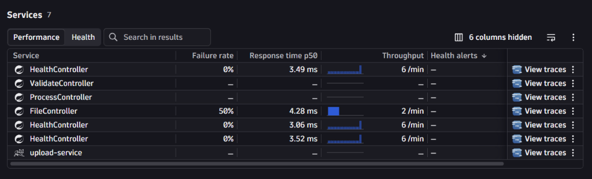
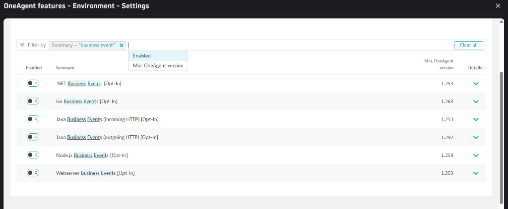
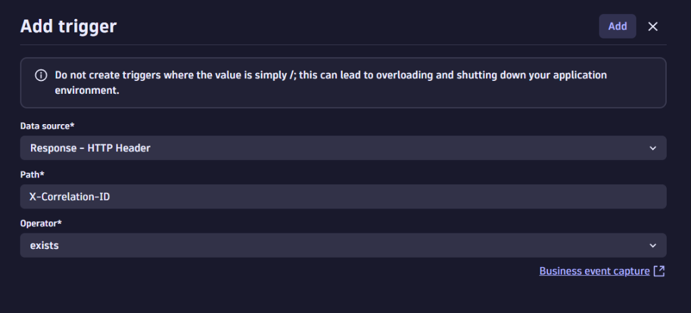
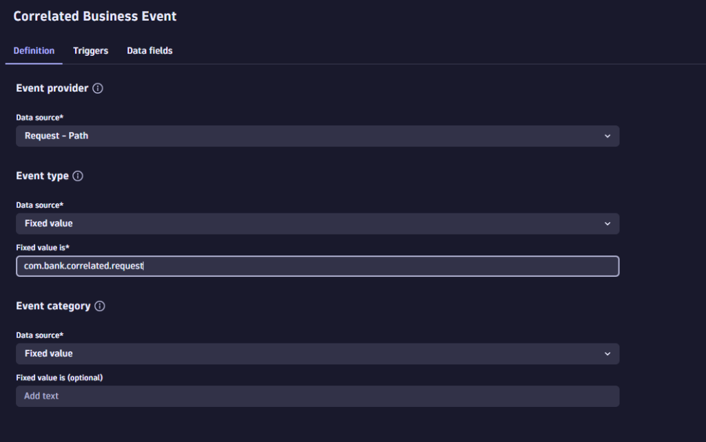
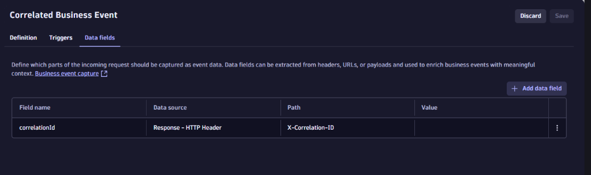
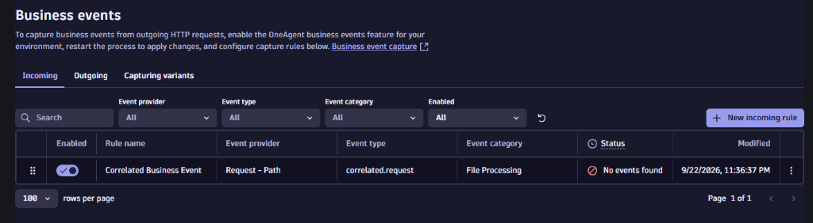
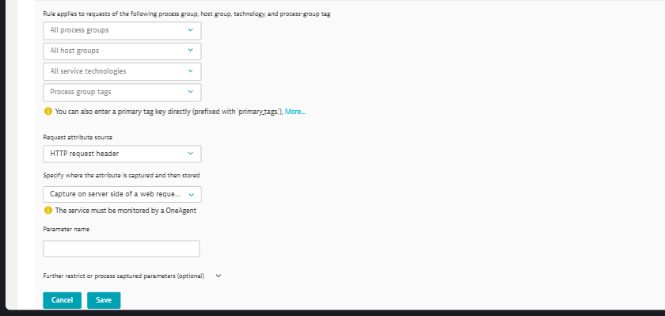
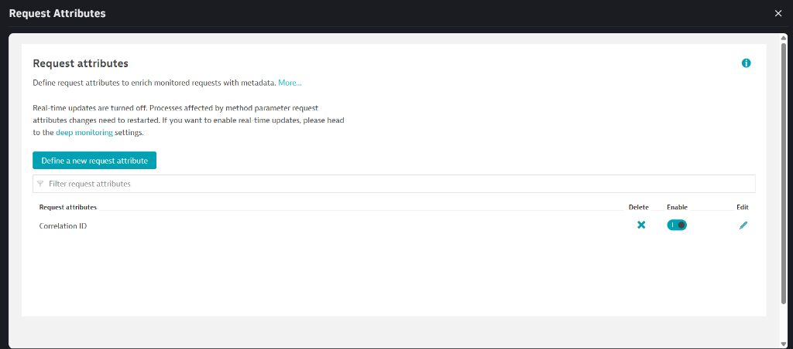

# Dynatrace Setup Guide — File Processing POC

> **Approach:** Zero-code — OneAgent reads `X-Correlation-ID` from HTTP response headers only.
> No response body reading. No Dynatrace SDK. No sensitive data exposed.

---

## Table of Contents

1. [Get a Dynatrace Free Trial](#1-get-a-dynatrace-free-trial)
2. [Install OneAgent on Windows](#2-install-oneagent-on-windows)
3. [Verify OneAgent is Working](#3-verify-oneagent-is-working)
4. [Enable Business Event Capture Engine](#4-enable-business-event-capture-engine)
5. [Create ONE Capture Rule](#5-create-one-capture-rule)
6. [Add Request Attribute for Distributed Tracing](#6-add-request-attribute-for-distributed-tracing)
7. [Set Up Business Flow](#7-set-up-business-flow)
8. [DQL Queries](#8-dql-queries)
9. [Troubleshooting](#9-troubleshooting)

---

## 1. Get a Dynatrace Free Trial

1. Go to **https://www.dynatrace.com/trial/**
2. Click **"Start free trial"**
3. Choose **SaaS** (cloud-hosted — easiest for POC)
4. Fill in details, verify email, set password
5. Your environment URL will look like: `https://abc12345.live.dynatrace.com`

> 15-day trial, full access, no credit card needed.

---

## 2. Install OneAgent on Windows

### How to find it:

- Press **Ctrl+K** in Dynatrace → type **"Deploy OneAgent"** → click the result
- Or: Left sidebar → **Discovery & Coverage** → **Install** → **Install OneAgent**

### On the Install page:

1. Select **Windows**
2. Select **Full-Stack** monitoring mode (NOT Infrastructure-only)
3. Click **"Generate token"** → ⚠️ **Copy and save it immediately**
4. Click **"Download OneAgent installer"** or copy the PowerShell command shown
5. Open **PowerShell as Administrator** and run the installer
6. Wait 2-3 minutes for installation
7. **Restart all Spring Boot services** using `.\start-all.ps1`

---

## 3. Verify OneAgent is Working

1. Press **Ctrl+K** → type **"Services"** → you should see your Spring Boot controllers auto-detected:



> **Why 7 services?** Dynatrace detects each `@RestController` separately:
> - `FileController` = upload-service
> - `ProcessController` = processing-service
> - `ValidateController` = validation-service
> - `HealthController` ×3 = Spring Boot Actuator health checks (one per service)
> - `upload-service` = the JVM process itself

---

## 4. Enable Business Event Capture Engine

> **What this does:** Turns ON the engine inside OneAgent that runs capture rules on Java HTTP traffic.
> Without this toggle, capture rules are ignored. Your app code is NOT affected.

### How to find it:

- Press **Ctrl+K** → type **"OneAgent features"** → click the result
- Or: Left sidebar → **Settings** → **Collect and capture** → **General monitoring settings** → **OneAgent features**

### What to do:

1. In the **filter/search box** on the page, type: **`business event`**
2. You will see the list of toggles:



3. **Toggle ON** → **Java Business Events (incoming HTTP) [Opt-In]** (3rd row)
4. **Toggle OFF** → **Java Business Events (outgoing HTTP) [Opt-In]** (4th row — to avoid duplicate events)
5. Click **"Save changes"**
6. ⚠️ **Restart all Spring Boot services** — run `.\start-all.ps1`

> **Why incoming only?** If both are ON, the same HTTP call between Upload → Processing would be captured twice (once as outgoing, once as incoming), creating duplicate events.

---

## 5. Create ONE Capture Rule

> **You need only ONE rule** — not one per microservice.
> Any service that sends `X-Correlation-ID` in the response header gets captured automatically.
> Scales to 1000+ microservices without creating additional rules.

### How to find it:

- Press **Ctrl+K** → type **"Business events"** → click it under Settings
- Or: Left sidebar → **Settings** → **Collect and capture** → **Business events**

### Step 1: Click **"+ New incoming rule"** → name it `Correlated Business Event`

### Step 2: Add Trigger

Click the **"Triggers"** tab → click **"Add trigger"** and fill in:

| UI Field | What to select/type |
|----------|---------------------|
| **Data source** | `Response - HTTP Header` |
| **Path** | `X-Correlation-ID` |
| **Operator** | `exists` |



Click **"Add"** to save the trigger.

### Step 3: Fill in Definition

Click the **"Definition"** tab and fill in:

| UI Field | What to select/type |
|----------|---------------------|
| **Event provider → Data source** | `Request – Path` |
| **Event type → Data source** | `Fixed value` |
| **Event type → Fixed value is** | `correlated.request` |
| **Event category → Data source** | `Fixed value` |
| **Event category → Fixed value is** | `File Processing` |



### Step 4: Add Data Field

Click the **"Data fields"** tab → click **"+ Add data field"** and fill in:

| UI Field | What to select/type |
|----------|---------------------|
| **Field name** | `correlationId` |
| **Data source** | `Response – HTTP Header` |
| **Path is** | `X-Correlation-ID` |



### Step 5: Save

Click **"Save"** at the top right. Your rule should now appear in the list:



> **Status will show "No events found"** until you upload a file. After uploading, wait 2-3 minutes.

---

## 6. Add Request Attribute for Distributed Tracing

> **What this does:** Makes `X-Correlation-ID` visible and searchable in distributed traces.
> Without this, the header is sent but Dynatrace doesn't display it in the trace view.

### How to find it:

- Press **Ctrl+K** → type **"Request attributes"** → click it
- Or: Left sidebar → **Settings** → **Collect and capture** → **Distributed tracing** → **Service request attributes**

### Step 1: Create the attribute

1. Click **"Define a new request attribute"**
2. Fill in:

| Field | Value |
|-------|-------|
| **Request attribute name** | `Correlation ID` |
| **Data type** | `Text` (keep default) |
| **First value** | Keep default |
| **Leave text as-is** | Keep default |

3. Leave both checkboxes unchecked

### Step 2: Add data source

4. Click **"Add new data source"**
5. Fill in:

| Field | Value |
|-------|-------|
| All process groups | Keep default ✅ |
| All host groups | Keep default ✅ |
| All service technologies | Keep default ✅ |
| **Request attribute source** | `HTTP request header` |
| **Capture on server side...** | Keep default ✅ |
| **Parameter name** | `X-Correlation-ID` |



6. Click **"Save"** on the data source dialog
7. Click **"Save"** on the top right

### Result:



> Now every distributed trace will show `Correlation ID` as a searchable field.
> Go to **Ctrl+K** → **"Distributed traces"** → filter by `Correlation ID = FILE-XXXXXXXX` to track a file through all 3 services.

---

## 7. Set Up Business Flow

### How to find it:

- Press **Ctrl+K** → type **"Business Flow"** → click it
- Or: Left sidebar → **Apps** → search for **"Business Flow"**

### What to do:

1. Click **"Create new configuration"** (or the **"+"** icon)
2. Name it: `File Processing Pipeline`
3. Set **Correlation ID** field to: `correlationId`
4. **Define Step 1 — Upload:**
   - Click on the first step
   - Click **"Add event"**
   - Filter by event provider containing `/api/files/upload`
   - Label: `File Uploaded`

5. **Define Step 2 — Processing:**
   - Click **"+ Add step"** (hover over step 1, click the Add tab at the bottom)
   - Filter by event provider containing `/api/process`
   - Label: `File Processed`

6. **Define Step 3 — Validation:**
   - Click **"+ Add step"**
   - Filter by event provider containing `/api/validate`
   - Label: `File Validated`

7. **Save** the flow

### What You'll See:

- A visual funnel: **Uploaded → Processed → Validated**
- Drop-off rates (files that failed processing never reach validation)
- Duration between steps
- Tree view and Funnel view options
- Click any step to drill down into individual file journeys

---

## 8. DQL Queries

Press **Ctrl+K** → type **"Notebooks"** → create a new notebook and run these:

### See All Business Events:
```dql
fetch bizevents
| filter event.type == "correlated.request"
| sort timestamp desc
| limit 50
```

### Track a Specific File Through the Pipeline:
```dql
fetch bizevents
| filter correlationId == "FILE-XXXXXXXX"
| sort timestamp asc
| fields timestamp, event.type, event.provider, correlationId
```

### Count Events Per Service:
```dql
fetch bizevents
| filter event.type == "correlated.request"
| summarize count = count(), by: {event.provider}
```

---

## 9. Troubleshooting

### Can't find a setting in Dynatrace?
→ Always try **Ctrl+K** (search bar) first. Type what you're looking for.

### OneAgent not detecting Spring Boot services?
→ Restart the services after OneAgent installation. Wait 5 minutes.
→ Ensure OneAgent is in **Full-Stack** mode (not Infrastructure-only).
→ Check: Ctrl+K → "Hosts" → your host → Processes

### Business events not appearing?
1. Is **"Java Business Events (incoming HTTP)"** toggle ON? (Ctrl+K → "OneAgent features")
2. Did you **restart** Spring Boot services after enabling?
3. Is the capture rule saved and enabled? (Ctrl+K → "Business events")
4. Upload a file and wait 2-3 minutes

### Business Flow is empty?
→ Verify the **Correlation ID** field is set to `correlationId` in the flow config
→ Run a DQL query to confirm events exist and contain `correlationId`
→ Make sure events match the filter in each step

### Services not communicating?
```powershell
# Check all 3 ports are in use:
netstat -ano | findstr "3001 3002 3003"
```
