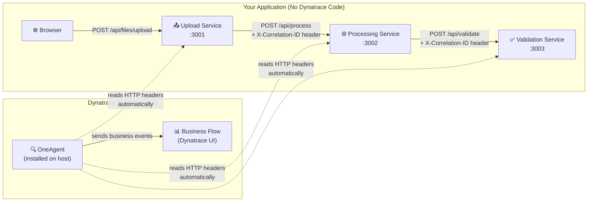
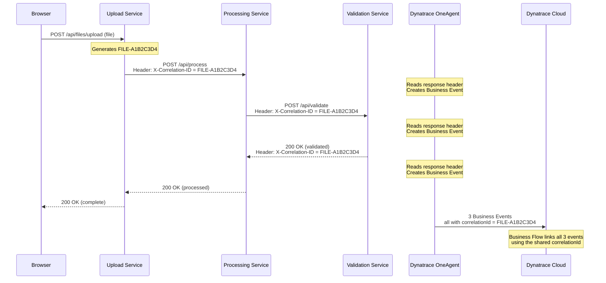

# File Processing Pipeline — Dynatrace Business Flow POC

A three-microservice file processing pipeline built with **Java 17 + Spring Boot 3.2**, designed to demonstrate **Dynatrace Business Flow** tracking using **only HTTP headers** — with **zero Dynatrace SDK or API calls** in the application code.

---

## Architecture Overview



---

## How It Works — Manager-Friendly Explanation

### The Problem

> We have 1000+ microservices in our banking environment. We need to track a file's journey across multiple services (upload → processing → validation) in Dynatrace Business Flow. But **we cannot add any Dynatrace SDK, library, or API calls** to our application code due to banking security policies.

### The Solution: HTTP Headers + OneAgent Capture Rules

We solved this using a technique that requires **zero changes to Dynatrace from the application side**. Here's how:

```
┌─────────────────────────────────────────────────────────────────────┐
│                    HOW THE CORRELATION ID FLOWS                      │
│                                                                     │
│  Step 1: Upload Service GENERATES a unique ID                       │
│  ┌──────────────────────────────────────────────────┐               │
│  │ Upload Service receives file                      │               │
│  │ → Generates: X-Correlation-ID = FILE-A1B2C3D4    │               │
│  │ → Adds it to the HTTP RESPONSE HEADER            │               │
│  │ → Forwards it to Processing Service              │               │
│  └──────────────────────────────────────────────────┘               │
│                          │                                          │
│                          ▼                                          │
│  Step 2: Processing Service RECEIVES and FORWARDS the ID            │
│  ┌──────────────────────────────────────────────────┐               │
│  │ Processing Service reads X-Correlation-ID        │               │
│  │ from the incoming REQUEST HEADER                 │               │
│  │ → Processes the file                             │               │
│  │ → Adds X-Correlation-ID to RESPONSE HEADER       │               │
│  │ → Forwards it to Validation Service              │               │
│  └──────────────────────────────────────────────────┘               │
│                          │                                          │
│                          ▼                                          │
│  Step 3: Validation Service RECEIVES and RESPONDS with the ID       │
│  ┌──────────────────────────────────────────────────┐               │
│  │ Validation Service reads X-Correlation-ID        │               │
│  │ from the incoming REQUEST HEADER                 │               │
│  │ → Validates the results                          │               │
│  │ → Adds X-Correlation-ID to RESPONSE HEADER       │               │
│  └──────────────────────────────────────────────────┘               │
│                                                                     │
│  ════════════════════════════════════════════════════                │
│  Meanwhile, Dynatrace OneAgent (running on the host)                │
│  AUTOMATICALLY reads the X-Correlation-ID from each                 │
│  service's response header and creates a Business Event.            │
│  ════════════════════════════════════════════════════                │
└─────────────────────────────────────────────────────────────────────┘
```

### What Happens at Each Layer



---

## Why This Approach is Secure for Banking

| Concern | How We Address It |
|---------|-------------------|
| **No Dynatrace SDK in code** | ✅ Zero Dynatrace dependencies. `pom.xml` has no Dynatrace libraries |
| **No response body reading** | ✅ OneAgent only reads HTTP headers, never the response body |
| **No sensitive data exposed** | ✅ `X-Correlation-ID` contains only a random file ID (e.g., `FILE-A1B2C3D4`), no PII |
| **No application changes for Dynatrace** | ✅ Capture rules are configured entirely in Dynatrace UI |
| **Scales to 1000+ microservices** | ✅ ONE capture rule works for all services — if it sends `X-Correlation-ID`, it's tracked |
| **Standard HTTP practice** | ✅ Correlation IDs in headers is an industry-standard pattern (not Dynatrace-specific) |

---

## What Your Application Code Does (Only This)

```java
// Each service does just 2 things with the correlation ID:

// 1. Read it from incoming request header (or generate it if first service)
String correlationId = request.getHeader("X-Correlation-ID");
if (correlationId == null) {
    correlationId = "FILE-" + UUID.randomUUID().toString().substring(0, 8).toUpperCase();
}

// 2. Add it to the response header
return ResponseEntity.ok()
    .header("X-Correlation-ID", correlationId)
    .body(result);
```

**That's it.** No Dynatrace imports. No SDK. No API calls. Just standard HTTP headers.

---

## What Dynatrace Does (Fully External)

```
┌─────────────────────────────────────────────────────────┐
│           Dynatrace Configuration (UI Only)              │
│                                                         │
│  1. OneAgent Feature Toggle:                            │
│     → "Java Business Events (incoming HTTP)" = ON       │
│                                                         │
│  2. ONE Capture Rule:                                   │
│     → Trigger: Response header X-Correlation-ID EXISTS  │
│     → Extract: correlationId from the header value      │
│     → Event type: correlated.request                    │
│                                                         │
│  3. Business Flow:                                      │
│     → Correlation field: correlationId                  │
│     → Step 1: /api/files/upload                         │
│     → Step 2: /api/process                              │
│     → Step 3: /api/validate                             │
│                                                         │
│  Result: Visual funnel showing                          │
│  Uploaded → Processed → Validated                       │
│  with drop-off rates and duration metrics               │
└─────────────────────────────────────────────────────────┘
```

---

## Quick Start

### Start all services (one command):

```powershell
.\start-all.ps1
```

This opens 3 terminal windows — one per service.

### Open the UI:

**http://localhost:3001**

### Test the pipeline:

1. Drag & drop a file (any file — CSV, PDF, image, etc.)
2. Optionally enter an Account ID
3. Click **"Upload & Process"**
4. Watch the pipeline: Upload → Processing → Validation
5. Check the **Activity Log** for responses with correlation IDs

---

## Services

| Service | Port | Role |
|---------|------|------|
| **Upload Service** | 3001 | Accepts file uploads, generates correlation ID, triggers processing |
| **Processing Service** | 3002 | Simulates file processing, forwards correlation ID |
| **Validation Service** | 3003 | Validates results, responds with correlation ID |

## API Endpoints

### Upload Service (`:3001`)
| Method | Endpoint | Description |
|--------|----------|-------------|
| `POST` | `/api/files/upload` | Upload a file (multipart/form-data) |
| `GET` | `/api/files/{fileId}` | Get file status |
| `GET` | `/api/files` | List all files |

### Processing Service (`:3002`)
| Method | Endpoint | Description |
|--------|----------|-------------|
| `POST` | `/api/process` | Process a file (called by Upload Service) |
| `GET` | `/api/process/{processId}` | Get processing details |

### Validation Service (`:3003`)
| Method | Endpoint | Description |
|--------|----------|-------------|
| `POST` | `/api/validate` | Validate results (called by Processing Service) |
| `GET` | `/api/validate/{validationId}` | Get validation details |
| `GET` | `/api/validate/status/{fileId}` | End-to-end file status |

---

## Prerequisites

- **Java 17+** (`java -version`)
- **Maven 3.8+** (`mvn -version`) — or use the included Maven Wrapper (`mvnw`)
- **Dynatrace OneAgent** — installed in Full-Stack mode ([setup guide](./DYNATRACE_SETUP_GUIDE.md))

## Dynatrace Setup

See **[DYNATRACE_SETUP_GUIDE.md](./DYNATRACE_SETUP_GUIDE.md)** for complete step-by-step instructions with screenshots.

---

## Project Structure

```
dynatrace-learning-business-flow/
├── frontend/                    # Static HTML/CSS/JS UI
│   ├── index.html
│   ├── styles.css
│   └── app.js
├── upload-service/              # Spring Boot :3001
│   └── src/main/java/.../
│       ├── controller/FileController.java
│       └── config/WebConfig.java
├── processing-service/          # Spring Boot :3002
│   └── src/main/java/.../
│       ├── controller/ProcessController.java
│       └── config/WebConfig.java
├── validation-service/          # Spring Boot :3003
│   └── src/main/java/.../
│       ├── controller/ValidateController.java
│       └── config/WebConfig.java
├── docs/screenshots/            # Dynatrace UI screenshots
├── DYNATRACE_SETUP_GUIDE.md     # Step-by-step Dynatrace setup
├── start-all.ps1                # Start all 3 services
├── demo-transactions.csv        # Sample file for testing
└── README.md                    # This file
```
